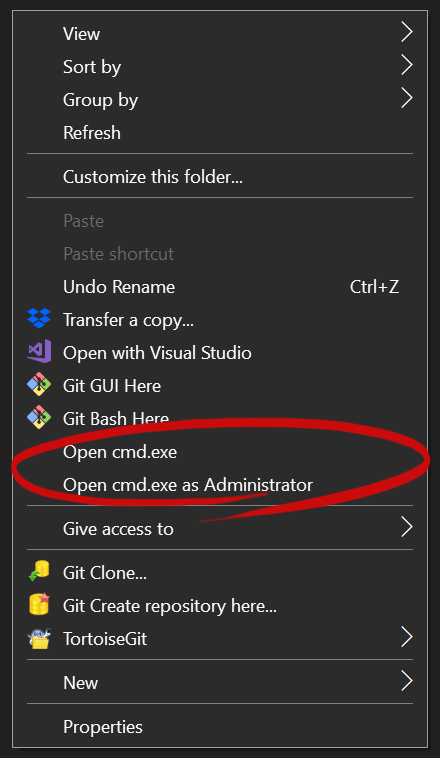

# Handful .cmd scripts and .reg-files
| Filename           | Description                                                                                                    |
|--------------------|----------------------------------------------------------------------------------------------------------------|
| open_cmd.reg       | Add context-menu item "Open CMD in current folder" with the current command path changed to the current folder |
| open_cmd_admin.reg | Same, with admin privileges                                                                                    |
| open_cmd_admin.reg | Add both menu items mentioned above                                   |
